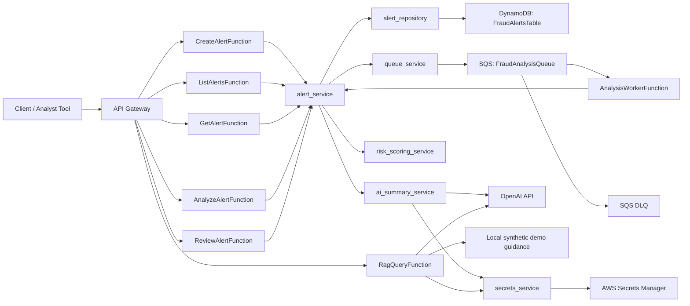

# Architecture

## High-Level Diagram

## NTT DATA Agent-Oriented Demo View

The React interview UI presents the existing services as four logical workflow stages: triage/risk analysis, evidence retrieval, investigation planning, and human review. These are workflow roles, not autonomous agents.

The UI creates an alert through the existing API, polls the existing alert endpoint while SQS processing runs, queries the additive fraud demo knowledge-base option, creates a deterministic structured task plan, and records the analyst's final action through `POST /alerts/{alertId}/review`.

See `docs/nttdata-agent-platform-demo.md` for the exact prototype boundary and five-minute demonstration flow.

## Request Flow For `POST /alerts`

1. API Gateway routes the request to `CreateAlertFunction`.
2. The handler parses the JSON body and performs basic API-level validation.
3. `alert_service.create_alert` validates the input payload, generates an `alertId` if needed, and sets the initial status to `PENDING_ANALYSIS`.
4. `alert_repository.create_alert` writes the alert to DynamoDB using:
   - `PK = ALERT#{alertId}`
   - `SK = METADATA`
5. `queue_service.send_analysis_job` sends an SQS message for background analysis.
6. The API returns quickly with the created alert payload instead of waiting for scoring and AI summary generation.

## Async Analysis Flow

1. `FraudAnalysisQueue` receives an analysis message with:
   - `alertId`
   - `analysisType`
   - `requestedAt`
2. `AnalysisWorkerFunction` is triggered by SQS.
3. The worker parses each record and calls `alert_service.analyze_alert(alertId)`.
4. `alert_service` loads the alert, updates status to `ANALYSIS_IN_PROGRESS`, and runs:
   - `risk_scoring_service.calculate_risk_score`
   - `ai_summary_service.generate_investigation_summary`
5. `alert_repository.update_analysis_result` stores the combined analysis result.
6. `alert_repository.update_status` marks the alert `ANALYSIS_COMPLETED`.
7. If processing repeatedly fails, SQS moves the message to the dead-letter queue.

## Responsibility Of Each Component

- `src/handlers/*`
  - API and SQS entry points only
  - parse input
  - map service results to HTTP or batch responses
- `src/services/alert_service.py`
  - workflow orchestration
  - alert creation defaults
  - status transitions
  - coordination of repository, queue, scoring, and summary services
- `src/services/risk_scoring_service.py`
  - deterministic, explainable scoring logic
  - source of `riskScore` and `riskLevel`
- `src/services/ai_summary_service.py`
  - investigator-friendly summary generation
  - fallback behavior when OpenAI is unavailable
- `src/services/queue_service.py`
  - SQS messaging only
- `src/services/secrets_service.py`
  - Secrets Manager retrieval and in-memory secret caching
- `src/repositories/alert_repository.py`
  - DynamoDB persistence only
- `template.yaml`
  - infrastructure definition

## Why SQS Is Used

SQS decouples the API from the slower analysis path.

Benefits in this project:

- API requests return quickly
- analysis can scale independently from the public API
- transient worker failures can be retried automatically
- failed messages can be isolated in a DLQ
- the system is easier to evolve toward more advanced background processing later

## Why Deterministic Scoring And AI Summary Are Separated

The separation is deliberate.

Deterministic scoring:

- is explainable
- is testable
- produces the canonical `riskScore` and `riskLevel`
- gives investigators concrete rule-based signals

AI summary generation:

- improves readability and triage ergonomics
- turns signals into concise investigation guidance
- is optional and fallible
- must not make the final fraud decision

This design keeps risk classification stable even if AI is unavailable or produces low-quality output.
